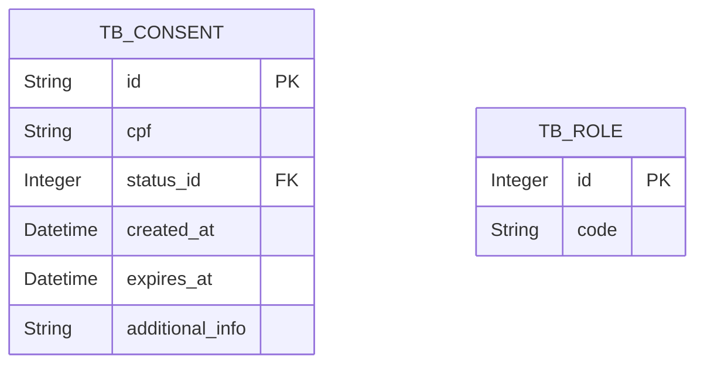

# Consents API
Uma API para gerenciar consentimentos de usuários para uso de dados.

## :clipboard: Estrutura do Projeto

### Camadas
- **Controller**: Responsável por expor os endpoints da API (`ConsentApi` e `IConsentApi`).
- **Service**: Contém a lógica de negócios (`ConsentServiceImpl`).
- **Repository**: Interage com o banco de dados para persistência de dados (`ConsentRepository`).
- **Adapter**: Realiza conversões entre entidades e objetos de requisição/resposta.
- **Model**: Define as entidades do domínio (`Consent`).

### Endpoints
- **POST /consents**: Criação de um novo consentimento.
- **GET /consents/{id}**: Busca de um consentimento por ID.
- **GET /consents**: Pesquisa de consentimentos com filtros opcionais.
- **PUT /consents/{id}**: Alteração de um consentimento existente.
- **DELETE /consents/{id}**: Revogação de um consentimento.

### Banco de Dados
- Utiliza PostgreSQL, configurado no `docker-compose.test.yml`.
- Scripts de inicialização:
    - `tables.sql`: Criação de tabelas.
    - `role.sh`: Configuração de permissões.

### :computer: Diagrama de Entidade-Relacionamento



### 🔧 Build e Deploy
- **Docker**:
    - `Dockerfile`: Configuração multi-stage para otimizar a imagem final.
    - `docker-compose.test.yml`: Configuração para ambiente de teste.
- **Maven**:
    - Gerenciamento de dependências e build do projeto.

### Testes
- Testes unitários `ConsentServiceTest` para validar a lógica de negócios e estressar as entradas e saídas dos métodos.
- Testes de integração (`ConsentIntegrationTest`) para validar os endpoints e cenários de erro.

### Padrões de Código
- **Value Objects**: Uso de VOs para encapsular lógica de validação e formatação de CPFs, Datas e mais.
- **DTOs**: Uso de DTOs para transferir dados entre camadas.
- **Centralização de Exceções**: Uso de `@ControllerAdvice` para padronizar respostas de erro.
- **Paginação e Ordenação**: Implementadas nos endpoints de pesquisa.
- **Validação**: Validação de campos com mensagens de erro detalhadas.

### Tratamento de Erros
Todos os `errorInfos` são tratados usando a anotação `@ControllerAdvice`. Isso permite um tratamento centralizado de exceções em todos os controladores da aplicação. O formato de resposta de erro é consistente e acessível em mais de uma lingua, seguindo a [RFC 9457](https://www.rfc-editor.org/rfc/rfc9457.html).

### :hammer_and_wrench: Configurações
- Variáveis de ambiente definidas no `.env` para facilitar a configuração do banco de dados e do perfil Spring (`dev`). Para configurar crie um arquivo `.env` em `/docker` com o seguinte conteúdo:
```bash
POSTGRES_IP=localhost:5432
POSTGRES_DB=consents
POSTGRES_SCHEAMA=?currentSchema=public
POSTGRES_USER=dbUser
POSTGRES_PASSWORD=mydbpass

SPRING_DATASOURCE_IP=localhost:5432
SPRING_DATASOURCE_DBNAME=consents
SPRING_DATASOURCE_SCHEAMA=?currentSchema=public
SPRING_DATASOURCE_USERNAME=dbUser
SPRING_DATASOURCE_PASSWORD=mydbpass
```

### 🚀 Swagger
- Documentação da API gerada automaticamente com **[Swagger-ui](http://localhost:8080/swagger-ui/index.html):**, acessível em `/swagger-ui.html`.